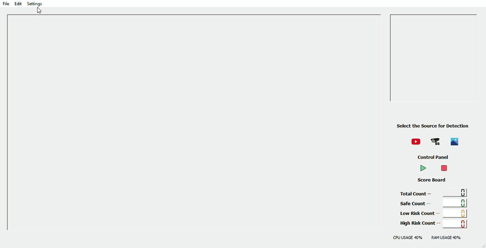

# AI-Tool-SocialDistancing

An AI tool to help authorities to ensure social distancing protocol in real time by using computer vision and Deep Learning Algorithms on various Video Surveillance sources, Developed upon YOLO V4 \& PYQT 5

ai tools for social distancing steps

run detection from image file 
1. click image button , a dialouge box will open,
2. in the dialouge box navigate and select the image media file and it will start detection

#

run detection from video file 
1. click video button (look likes youtube logo), a dialouge box will open,
2. in the dialouge box navigate and select the video media file
3. after that click on play button below the video button

run detection from webcam
1. click camera button (look likes cctv logo) and it will start detection

## Installation:
* Fork the repository and download the code.
* Download the following files and place it in the Yolo directory
   - https://github.com/pjreddie/darknet/blob/master/cfg/yolov3.cfg
   - https://pjreddie.com/media/files/yolov3.weights
* Install all the dependenices
* Run main_code.py

### Credits:

@article{yolov3,
  title={YOLOv3: An Incremental Improvement},
  author={Redmon, Joseph and Farhadi, Ali},
  journal = {arXiv},
  year={2018}
}
